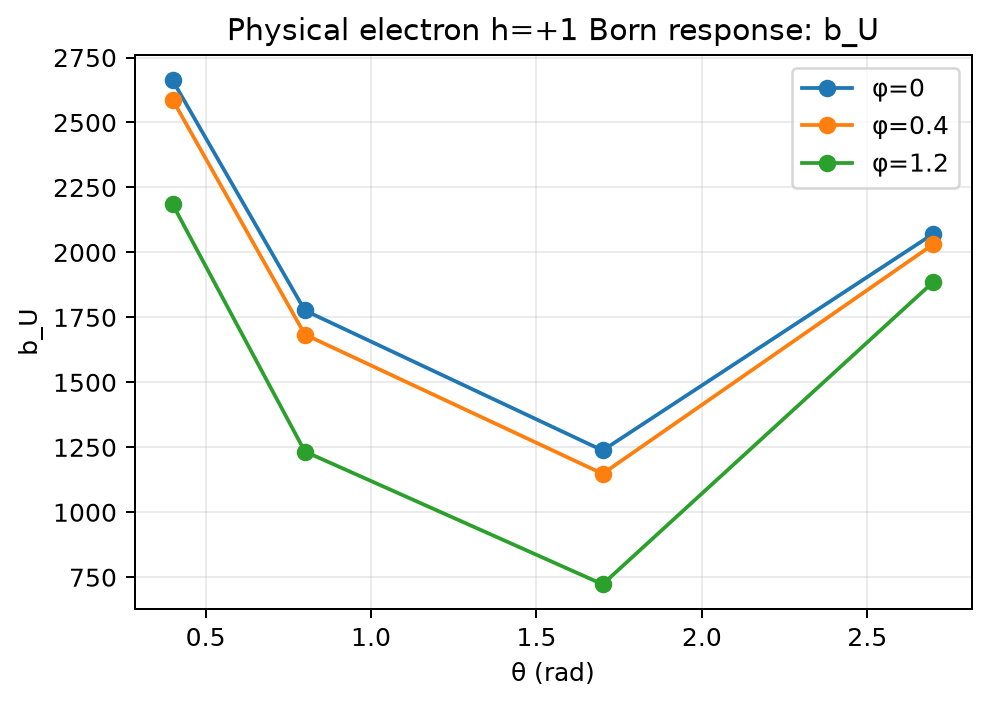
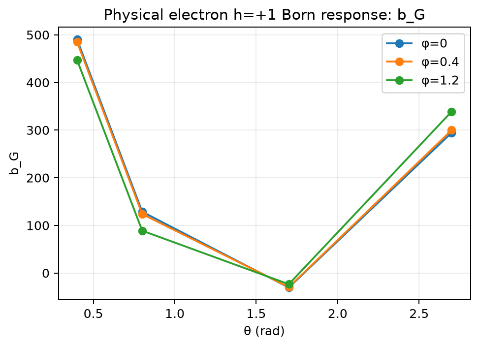
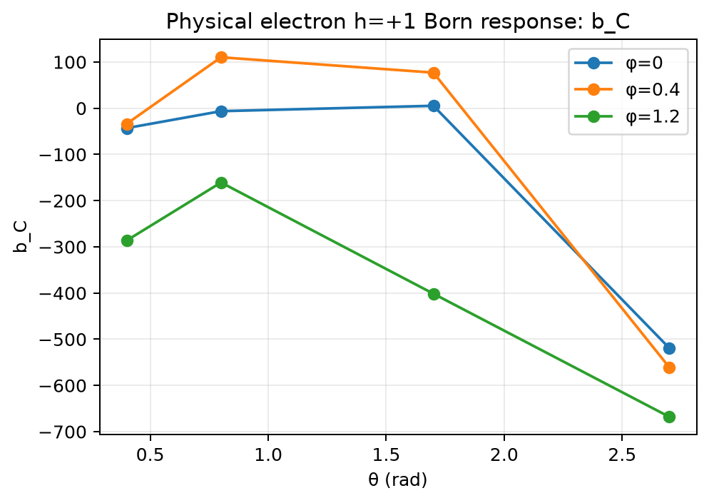
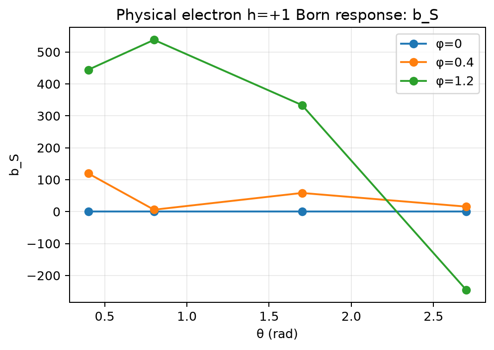
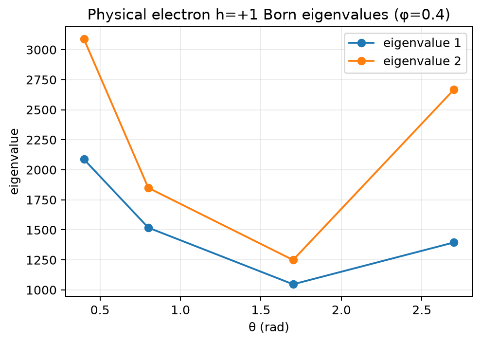
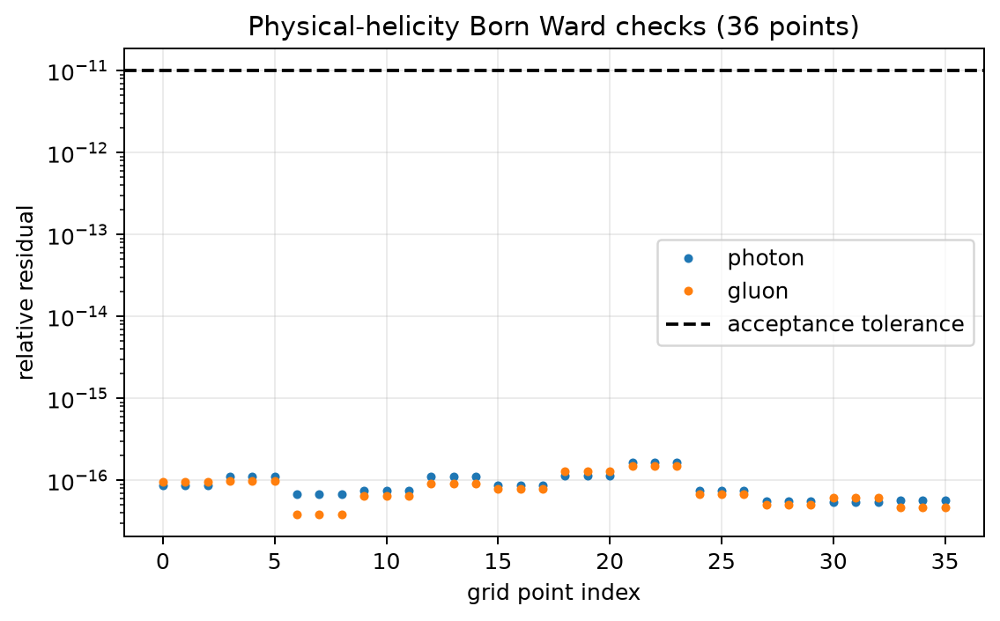

# Gluon Born hard response

For the independent spinor comparison, complete gluon response catalogue, and dense scan, see [gluon process validation](gluon-processes.md). The source Born trace and physical amplitude-first current require opposite lepton-index ordering. The corrected physical-helicity comparison and old-order negative control are documented in the [convention closure review](convention-closure.md).

The numerical program evaluates a specified Born analyzer for γ* g → Q Q̄, embedded in ℓ + g → ℓ′ + Q + Q̄. An incoming physical gluon has a 2 × 2 transverse polarization density matrix, so the hard process can resolve its trace, circular, and two linear-polarization components. This is a process-specific Born response, not a universal hard factor for every gluon-TMD observable.

## Two-diagram amplitude and conventions

The script sums the two heavy-quark-line photon/gluon orderings:

\[
\mathcal M^{\mu\alpha}=\gamma^\mu\frac{\slashed p_1-\slashed q+m_Q}{(p_1-q)^2-m_Q^2}\gamma^\alpha
+\gamma^\alpha\frac{\slashed p_1-\slashed k+m_Q}{(p_1-k)^2-m_Q^2}\gamma^\mu.
\]

Here μ is the virtual-photon index and α is the incoming-gluon index. The gluon physical basis uses α = x,y. The metric is (+,−,−,−), gamma matrices are the Dirac representation with `{γμ,γν}=2gμν`, and slashed momenta use the lowered four-vector. The incoming momenta are q and k, outgoing heavy quark and antiquark are p1 and p2, and q+k=p1+p2. The denominators and numerator momenta are exactly as written above. The lepton tensor uses ε⁰¹²³=+1 and helicity in [−1,1]. Couplings and overall phase-space/flux factors are omitted from B; the JSON description states the coupling multiplier `e^4 e_Q^2 g_s^2 T_F / Q^4`.

## Hard matrix and Stokes components

The program sums final heavy-quark spin with `(slash(p1)+mQ)` and `(slash(p2)−mQ)`, contracts with the leptonic tensor, and forms Bᵢⱼ for i,j = x,y. The convention is

\[\mathrm{rate}=\operatorname{Tr}(B D_g).\]

With the stated conjugate-amplitude-first gluon correlator index order, this contraction fixes the gluon-side signs. The physical Born matrix contracts the retained source tensor as `L_source[nu,mu]` with the amplitude-first heavy trace. Independent electron amplitudes check the helicity sign; see the [ordered-current review](convention-closure.md).

The code defines the four real analyzer coefficients

\[
b_U=(B_{xx}+B_{yy})/2,\quad b_G=\operatorname{Im}B_{xy},\quad
b_C=(B_{xx}-B_{yy})/2,\quad b_S=\operatorname{Re}B_{xy}.
\]

`b_U` responds to the trace/unpolarized sector; `b_G` to circular polarization; `b_C` and `b_S` to orthogonal linear-polarization components. Together they show which gluon-correlator components the hard process can analyze:

```text
gluon correlator Gamma^{ij}
        |
        +--> trace sector
        +--> circular sector
        +--> linear-C sector
        +--> linear-S sector
                    |
                    v
              hard matrix B_ij
                    |
                    v
                Tr(B D_g)
```

## Diagnostics and tolerances

The code checks `l²=l′²=k²=0`, `q²=−Q²`, `p1²=p2²=mQ²`, and four-momentum conservation; the largest absolute residual must be below `1e-9`. It tests the photon Ward identity by replacing the photon current with q and the gluon Ward identity by replacing the gluon polarization with k **between on-shell spin projectors**. Their relative residuals must each be below `1e-11`. The individual diagram numerators need not vanish separately. It checks `||B−B†||/max(1,||B||)<1e-11` and eigenvalues of the Hermitian part at least `−1e-11 max(1,||B||)`.

## Reference point

The supplied point is √s=5 GeV, Q²=4 GeV², mQ=1.5 GeV, θ=0.8, φ=0.4, incoming lepton energy 10 GeV, and physical electron h=+1. Reproduce it with:

```bash
python src/gluon_born_response.py --output results/gluon_born_report.json
```

The regenerated `results/gluon_born_report.json` includes the physical-helicity convention and source digest, all input four-vectors, B real/imaginary parts, both eigenvalues, four Stokes values, both Ward residuals, Hermiticity and kinematic residuals, and five passing Boolean checks. See the [generated result summary](generated-results.md) for values read directly from a validated run. These are coupling-stripped hard responses, not lithium-7 cross sections.

## Grid and diagnostic figures

The [grid runner](reproducing-results.md) evaluates θ = 0.4, 0.8, 1.7, 2.7; φ = 0, 0.4, 1.2; and physical electron h = −1, 0, +1. The independent physical comparison covers all 36 grid points.

Each figure below shows **physical-helicity Born-level hard-response coefficients or validation diagnostics, not lithium-7 cross-section predictions**. The lines connect the supplied grid points; they are guides to the eye. The `b_G` sign is anchored by independent physical electron spinors.

| Coefficient | Figure |
|---|---|
| Trace `b_U` |  |
| Circular `b_G` |  |
| Linear `b_C` |  |
| Linear `b_S` |  |
| Hard-matrix eigenvalues |  |
| Ward residuals |  |
