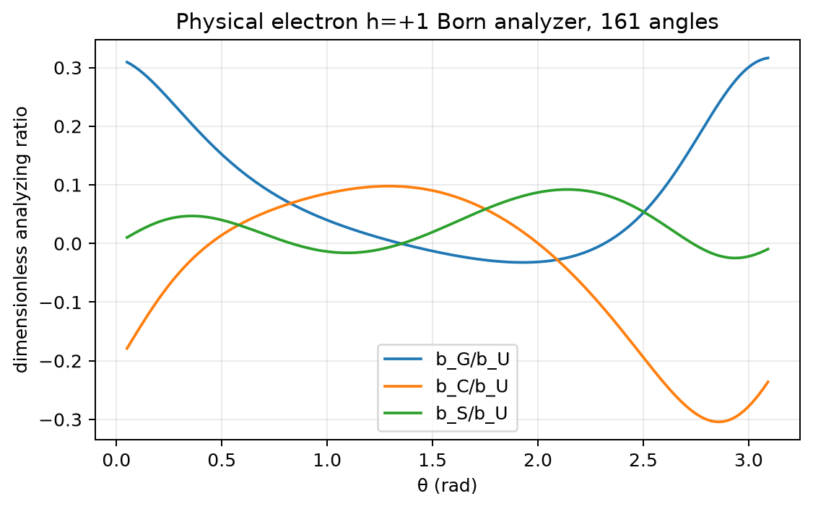
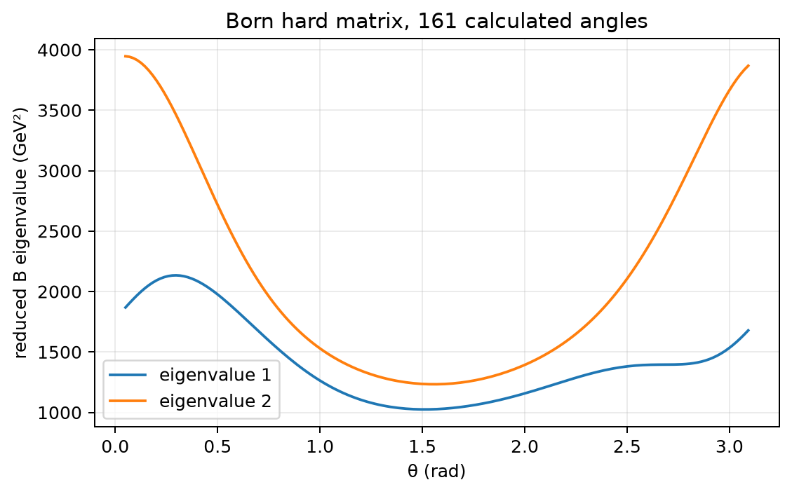
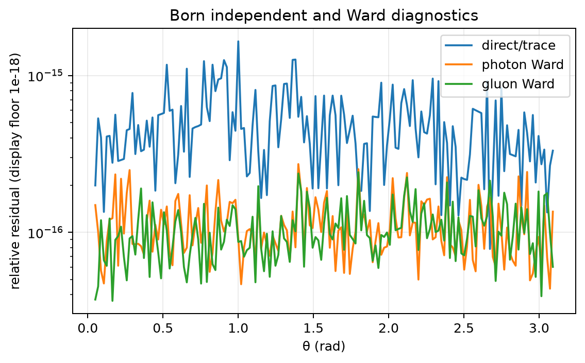
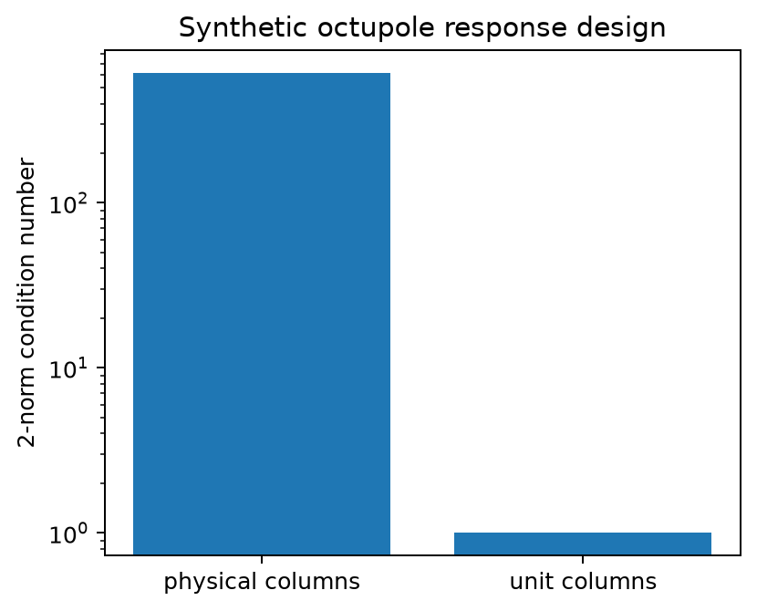

# Gluon response and heavy-pair Born checks

The cumulative `gluon-processes` profile extends `quark-processes`. It checks the complete 32-term gluon target response, fourteen octupole cone modes, and an independently coded heavy-quark-pair Born amplitude. Its synthetic coefficients and event rates are test inputs, not lithium-7 predictions. The later cumulative profiles add collinear, Fourier, local-moment, conditional-positivity, and ordered-current convention checks.

## Gram convention and response rows

The source's conjugate-amplitude-first convention is $B_{ij}=\sum_X M_iM_j^*$, $D_{ij}=e_i^*e_j$, and $W=\operatorname{Tr}(BD)$. The circular Stokes coefficient is $b_G=\operatorname{Im}B_{xy}$. The Stokes module checks symbolic projections, the characteristic polynomial, complex and mixed polarization rates, and passive unitary basis covariance. A circular example distinguishes transposing just B or D.

The reviewed source rows in `src/gluon_response_fixture.py` are separate from the generators. `src/gluon_responses.py` evaluates every row through a Cartesian correlator and matrix trace, and separately through the complex-helicity construction. Both are compared as exact Fourier/Laurent identities with the fixture. There are 8 number, 8 helicity, and 16 linear-polarization coefficients, partitioned 2, 6, 10, 14 by target rank. The low linear branches have factors $1/2,1,1$ for $m=1,2,3$; all high branches have $1/4$. The symbolic parent mass is positive and $t=|k_T|/M_A$.

## Physical octupole separation

`src/gluon_octupole.py` constructs $\rho_\eta=I/4+\eta\beta_3X_3(\hat n)$ and traces target operators in both physical states. At the generic cone $\cos\vartheta=3/5$, the signed factors are $(-9/25,8/25,48/25,32/25)$. Four spin-setting rates reproduce each of the fourteen source response rows. The independent Fourier and trigonometric-product Gram calculations give $\operatorname{diag}(1,1/2,\ldots,1/2)$ and determinant $2^{-13}$. The standalone checker reconstructs this witness from `certificates/gluon_angular.json`; its source digest binds it to the current code and convention. An 11 by 8 angular grid resolves every product frequency: $|p|$ is at most 5 and $|q|$ at most 3, so product frequencies are at most 10 and 6, below the respective grid sizes.

The four-rate moments use $Z=1$ for the beam-odd constant row and $Z=2$ for other rows, with denominator $b_U f_{00}^g$. Thus they recover ratios to the unpolarized TMD input; absolute normalization needs a separate $f_{00}^g$. The longitudinal cone retains only $m=0$. A transverse cone has both LLT and TTT factors $(-1/2,5/2)$; the eight-angle preparation projector removes LLT, and the rank-one, rank-three, and rank-five recoil moments use $2/(5\pi)$.

`src/gluon_reconstruction.py` generates mixed synthetic rates from actual Cartesian target operators and the **independent** Born amplitude. A separate source-mode design matrix recovers all fourteen coefficients. The known nonnegative acceptance $1+0.2\cos\varphi+0.1\sin\psi+0.05\cos(\varphi+\psi)$ leaks into naive moments; fitting its weighted matrix recovers the inputs. Reported condition numbers specify whether physical columns or unit-normalized columns are used. Explicit rank-loss calculations cover absent circular/linear analyzers, a vanishing cone factor, beam averaging, a fixed preparation azimuth, aliasing, $O=0$, and $t=0$. These are identifiability limits, not evidence that a TMD vanishes.

The synthetic hadronic fraction check uses $x_{\rm Bj}=0.05$, $M_{Q\bar Q}^2=25$ GeV², and $Q^2=4$ GeV², giving $x_g=x_{\rm Bj}(1+M_{Q\bar Q}^2/Q^2)=0.3625$. The hard matrix is evaluated at a collinear Born event; the nonzero target recoil variable is a separate leading-power TMD input and is not injected into exact hard-event momentum conservation.

## Independent Born route and normalization

`src/born_direct.py` builds massive quark and antiquark spinors, massless lepton helicity spinors, and both diagram chains without importing the production trace. It checks spin sums and photon/gluon Ward cancellation between the diagrams. The comparison includes the full complex 2 by 2 matrix and circular/elliptic rates. `src/born_precision.py` repeats selected direct-amplitude cases using string inputs at 50 and 80 decimal digits with a scoped mpmath precision. These extra digits are a stability comparison, not interval bounds.

The source benchmark gives reduced $(b_U,b_G,b_C,b_S)\approx(1684,-123.6,110.2,5.977)$ GeV². The independently constructed lepton spinors are physical helicity eigenstates. Their amplitude-first current tensor is the transpose of the source tensor at the same helicity. The source Born trace is amplitude-first, so its literal contraction disagrees with physical helicity; `compare_source_label` is only a historical index-order adapter. `compare` keeps the literal mismatch visible. See the [ordered-current review](convention-closure.md). No production sign or reference value has been changed.

The reduced matrix omits $e^4e_Q^2g_s^2T_F/Q^4$. Explicit SU(3) generator traces yield $T_F=1/2$. The incoming spin average enters once through $D_{\rm in}=I/2$, with no second average of a definite lepton helicity. The partonic flux is $1/(2\hat s_{\ell g})$, and the reduced/full matrices scale as $r^2/r^{-2}$ under a common momentum rescaling. These checks do not supply the hadronic measurement Jacobian or nonperturbative input for a binned cross section.

The independent route compares all 36 legacy grid cases and all 483 evaluated cases of the 161-angle by three-polarization dense scan. Each saved case has its exact input tuple, complex matrix, Stokes values, eigenvalues, Ward residuals, and direct/trace residual. Domain tests reject zero or negative $Q^2$, nonpositive mass, below-threshold mass, nonfinite inputs, and the axis-degenerate lepton-energy boundary. Raw Hermiticity is checked before using a Hermitian eigensolver. Separate checks cover beam conjugation and partial-polarization mixing, azimuthal periodicity, and active rotation of all hard-event momenta.

## Evidence and reproduction

Run the profile and use the printed run directory, which can be placed outside this checkout:

```sh
python scripts/run_validation.py --profile gluon-processes --output-root /tmp/li7-runs
python scripts/check_gluon_angular_certificate.py
python scripts/update_report_summary.py --run-dir /tmp/li7-runs/PRINTED-RUN --output /tmp/li7-summary.md
python scripts/make_plots.py --run-dir /tmp/li7-runs/PRINTED-RUN
```

The run-specific validator rejects incomplete scan tuples, wrong helicities, stale high-precision values, fixture mismatches, mixed certificate attestations, failed diagnostics, and missing or duplicated check IDs. A profile PASS is a computational result within these Born and synthetic assumptions. Wilson-line process selection, soft factors, factorization, QCD matching, evolution, and complete partonic positivity remain analytic or later work.








